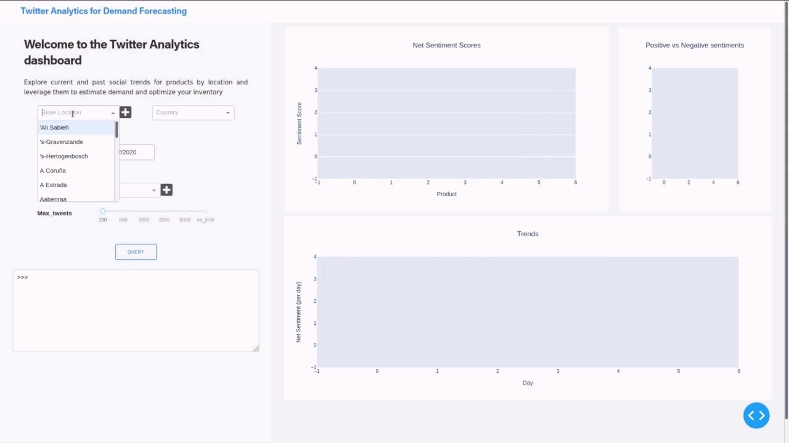
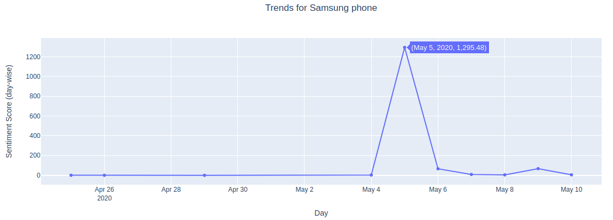

# Twitter Analytics for Demand Forecasting

## Introduction


Retailers try to increase their sales and improve demand forecasting through better understanding
their customers. To do so, they should be aware of what their clients’preferences are or might
be in the near future.

Social media can be used to tap into the minds of potential customers which can be used to make
predictions of products' future demand and stock up the inventory accordingly. This project aims
to provide insights into the social trends about popularity and interest about products/brands at a
particular region.

## Why Twitter?

Twitter is a great platform to share concise, to the point posts. Compared to other social media
platforms, twitter data is easy to mine. Furthermore, people often take their issues to twitter rather
than going to customer support and it is the same place where people express their satisfaction or 
happiness about using a product.


Here's a simple demo:




As a sample use case, I provide analysis for top 5 smartphone brands in India with location set to Delhi and
considering tweets from 25th April to 11th May.

Here are the net sentiment scores for all the 5 brands, namely Oneplus, Samsung, iPhone, Nokia and Redmi

 


##### Sentiment Scores are:  

|         | Net_sentiment_score |
|---------|---------------------|
| OnePlus | 1092                |
| Samsung | 1448                |
| iPhone  | 860                 |
| Nokia   | 754                 |
| Redmi   | 68                  |  


According to sentiment scores the order of demand becomes:  
Samsung > OnePlus > iPhone > Nokia > Redmi

Now, if we analyze the number of tweets tweeted related to each of these brands:

|         | Pos | Neg | Total | Pos% |
|---------|-----|-----|-------|------|
| OnePlus | 642 | 103 | 745   | 86%  |
| Samsung | 58  | 13  | 71    | 81%  |
| iPhone  | 480 | 93  | 573   | 83%  |
| Nokia   | 137 | 19  | 156   | 87%  |
| Redmi   | 238 | 40  | 278   | 85%  |

If we go by the number of tweets, OnePlus and iPhone are by far the most discussed and popular brands.
The percentage of positive tweets is almost in the same range 81 - 87% with minor differences.

Futher exploring how well this works, let us consider 2 cases: Samsung and Redmi.

##### Trends for Samsung:




The sentiment score surged unusually high on May 5 and May 9. The following tweets were primarily
responsible for raising the score:  

 5 May:  
 


9 May:  


##### Trends for Redmi:  


The sentiment score plunged down on 7 and 8 May. The following tweets were primarily
reponsible:

  

However, Redmi tends to be more discussed brand than Samsung and has higher share of positive tweets.  

Futher, Samsung has a higher sentiment_score but lesser number of tweets as compared to OnePlus which
has a lower sentiment_score but far more number of positive tweets. This means that OnePlus tends to
be a more popular brand and people are more excited about it.

To take the volume of positive tweets into account,, I define a ratio r, r = (p/T) 
where p = number of positive tweets for the product under consideration  
and T = total number of tweets for all products combined  

Then multiply this ratio r to the net_sentiment_score (s):

final_score = s * r

|         | s    | p   | r=(p/T) | s x r |
|---------|------|-----|---------|-------|
| OnePlus | 1092 | 642 | 0.35    | 385   |
| Samsung | 1448 | 58  | 0.03    | 46    |
| iPhone  | 860  | 480 | 0.26    | 226   |
| Nokia   | 754  | 137 | 0.08    | 57    |
| Redmi   | 68   | 238 | 0.13    | 9     |


So the demand in decreasing order is: OnePlus > iPhone > Nokia > Samsung > Redmi

## Functioning

#### Tweets Mining
Tweets are downladed by using the
[GetOldTweets](https://github.com/marquisvictor/Optimized-Modified-GetOldTweets3-OMGOT) Library.
This library has a limitation: It is not guaranteed that all tweets will be mined. This is because it queries the twitter search engine till it can no longer get any more information. I found it to best working best for extracting tweets of last 15 days.

#### Performing Sentiment analysis
[VADER](https://github.com/cjhutto/vaderSentiment) is used for this task. As given in their readme:
VADER (Valence Aware Dictionary and sEntiment Reasoner) is a lexicon and rule-based sentiment analysis
tool that is specifically attuned to sentiments expressed in social media, and works well on texts
from other domains.  

For each tweet, sentiment scores are predicted in the range (-1.0 to 1.0).
Further, the number of retweets and number of favorites are also considered to give more
weightage to that tweet:  

```score = score * (tweets['retweets'][i] + tweets['favorites'][i] + 1)```  

Doing so, further increase the score if sentiment is positive or decreases the score if negative.

#### Mapping sentiments to a value to gauge demand

net_sentiment_score for each product is calculated by adding up the sentiment-scores of all the tweets
related to that product. Using this score a final_score is assigned(as explained above). This score likely represents the demand of a product relative to other products under consideration.

#### Data Presentation

[Dash](https://github.com/plotly/dash) is used to build the web application. It will soon be deployed
on Heroku.
